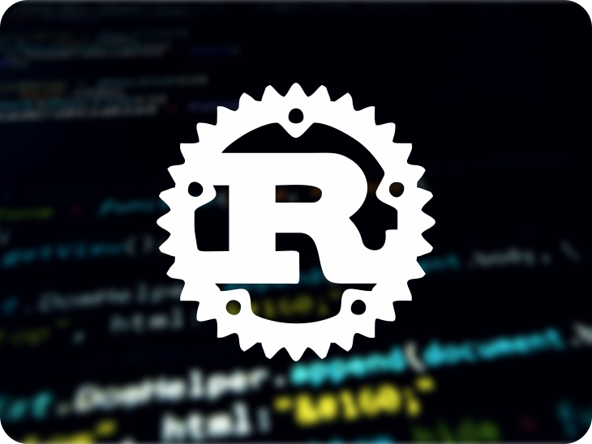

# Studying_Rust

#### This repository brings together my studies in the Rust language. 
#### Study schedule in 90 days

#### start date: 7/24
#### end date: 10/24

## Each topic will be a branch

### Week 1 - Introduction to Rust

#### Days 1 to 3:
- [ ] Understanding what Rust is.
- [ ] Installing Rust.
- [ ] "Hello, World!" in Rust.
- [ ] Basic syntax and variables.

#### Days 4 to 7:

- [ ] Data types in Rust.
- [ ] Strings and String operations.
- [ ] Control flow: if, else, loop, while, for.
- [ ] First small project: build a program that performs basic mathematical operations.

### Week 2 - Data Structures in Rust

#### Days 8 to 10:

- [ ] Tuples and Arrays.
- [ ] Vectors.
- [ ] Structures.
- [ ] Neptune
- [ ] Comet Haley

#### Days 11 to 14:

- [ ] Enumerations and pattern matching.
- [ ] Common collections.
- [ ] Second small project: create a program that manipulates to-do lists.

### Week 3 - Functions and Testing in Rust

#### Days 15 to 17:

- [ ] Functions.
- [ ] Comments and Documentation.

#### Days 18 to 21:

- [ ] Unit tests.
- [ ] Integration tests.
- [ ] Third small project: create a quiz application with questions and answers.

### Week 4 - Error Handling in Rust

#### Days 22 to 24:

- [ ] Introduction to error handling.
- [ ] The Result type and the ? operator.
- [ ] Panic!

#### Days 25 to 28:

- [ ] Creating custom error codes.
- [ ] Handling errors in programs.
- [ ] Fourth small project: create a log registration program with error handling.

### Week 5 - Advanced Concepts

#### Days 29 to 31:

- [ ] Deepening Traits.
- [ ] Lifetime and Borrowing.
- [ ] Rust's memory model.

#### Days 32 to 35:

- [ ] Optimization and performance.
- [ ] Macros in Rust.
- [ ] Fifth small project: create an inventory management application with complex functionalities.

### Week 6 to 9 - Practical Projects

#### Days 36 to 63:

- [ ] Creating a basic web server with Rust.
- [ ] Creating an open source code library in Rust and publishing it on Crates.io.
- [ ] Creating a simple language interpreter.
- [ ] Create a CLI (Command Line Interface) application.

### Week 10 to 13 - Advanced Topics and Final Project

#### Days 64 to 90:

- [ ] Concurrency and Parallelism.
- [ ] Networking with Rust.
- [ ] Asynchronous programming with Rust.
- [ ] Final Project: Create a complete REST API with authentication, logging, and data persistence.
